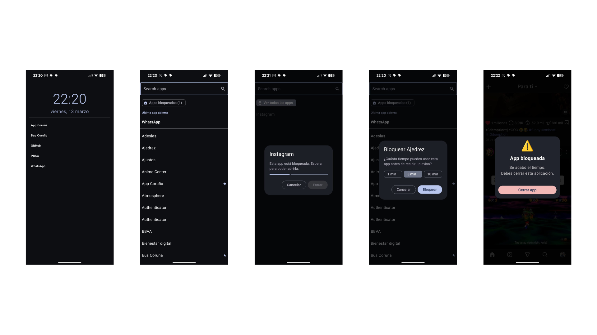

# 📱 MyLauncher

> [!TIP]
> **[Leer en español 🇪🇸](README_es.md)**

**MyLauncher** is a minimalist Android launcher designed to reclaim your focus and reduce screen time. Built with **Jetpack Compose**, it strips away the visual noise of traditional launchers, replacing icons with a clean, text-based interface.

---

## 🚀 Key Features

### ✨ Radical Minimalism
No icons, no distractions. By presenting your apps as simple text, MyLauncher reduces the dopamine hit associated with colorful icons, helping you use your phone more intentionally.

### ⭐ Quick Access Favorites
Keep your most essential tools just a swipe away. Customize your home screen with a list of favorite apps for instant access.

### 🔒 Intelligent App Blocking
Take control of your digital habits. When you need to access a "distracting" app, MyLauncher introduces intentional friction:
- **Reflection Timer:** A 10-second countdown to make you rethink if you really need to open the app.
- **Captcha Verification:** A random code you must type to prove you are focused and not just mindlessly tapping.

### ⏱️ Usage Time Limits
Set a timer for your apps (1, 5, or 10 minutes). Once the time is up, MyLauncher will automatically overlay a lock screen, reminding you to get back to what matters.

### 🔍 Powerful Search
Find any app instantly with a fast, responsive search bar. Your apps are always organized alphabetically for easy navigation.

### 🕐 Smart History
The last app you used is always pinned at the top of your app list, making it easy to jump back into your current task.

### 🌓 Beautifully Simple Design
- **Real-time Clock:** Always know the time and date with a clean, elegant display.
- **Theming:** Full support for both Light and Dark modes to suit your preference and save battery.
- **Edge-to-edge:** A modern look that uses every pixel of your screen.

---

## 🛠️ Getting Started

1. **Install the app.**
2. **Set as Default:** Go to your phone's settings and set MyLauncher as your default Home app.
3. **Grant Permissions:** To enable the usage monitor and app blocking, you'll need to grant "Usage Access" when prompted.

---

## 👩‍💻 For Developers
Are you a developer? Check out our **[Development Guide](DEVELOPMENT.md)** to learn how to build and contribute to MyLauncher.

---

## 💡 Why MyLauncher?
Traditional launchers are designed to keep you engaged. MyLauncher is designed to help you **disengage**. It’s not just a launcher; it’s a tool for a more mindful digital life.
